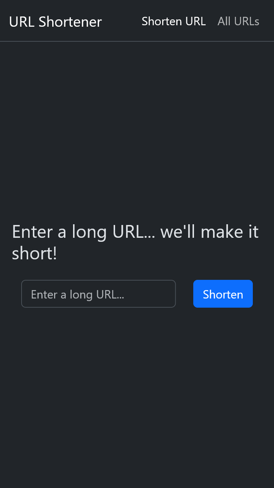

# URL Shortener

This project was created for me to refresh my React skills. Its sister project is [a Kotlin/Spring Boot API](https://github.com/un1r8okq/url-shortener-api).

## Getting started

1. Install NodeJS 20.x.x
2. Run `npm install`
3. Run `npm start`
4. Start [the API](https://github.com/un1r8okq/url-shortener-api)

